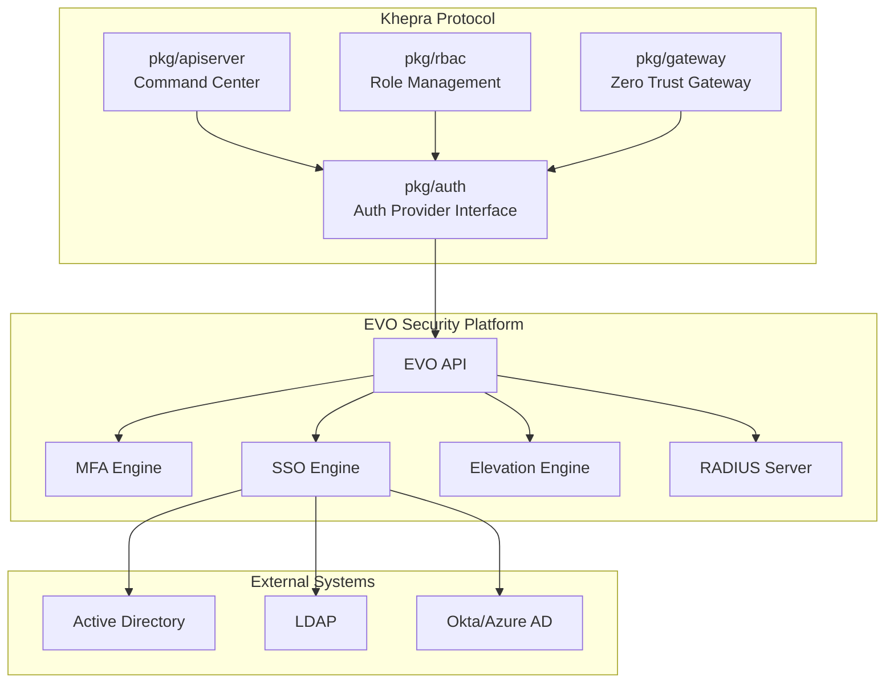
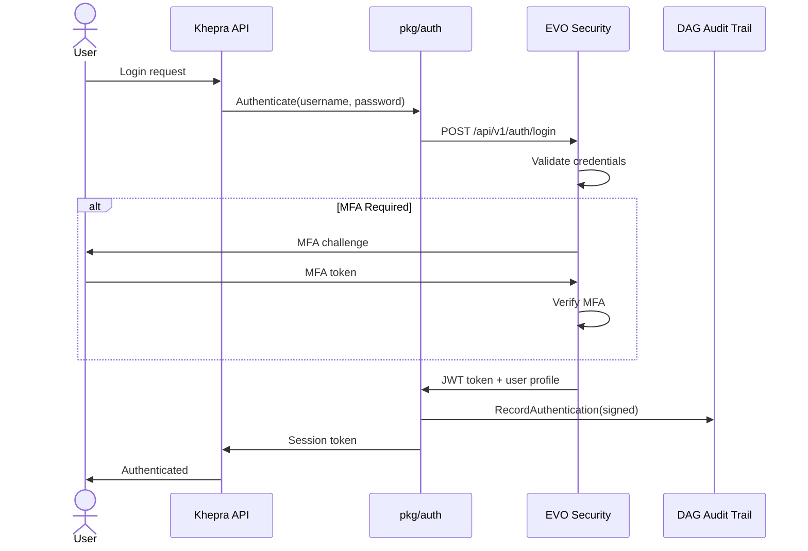
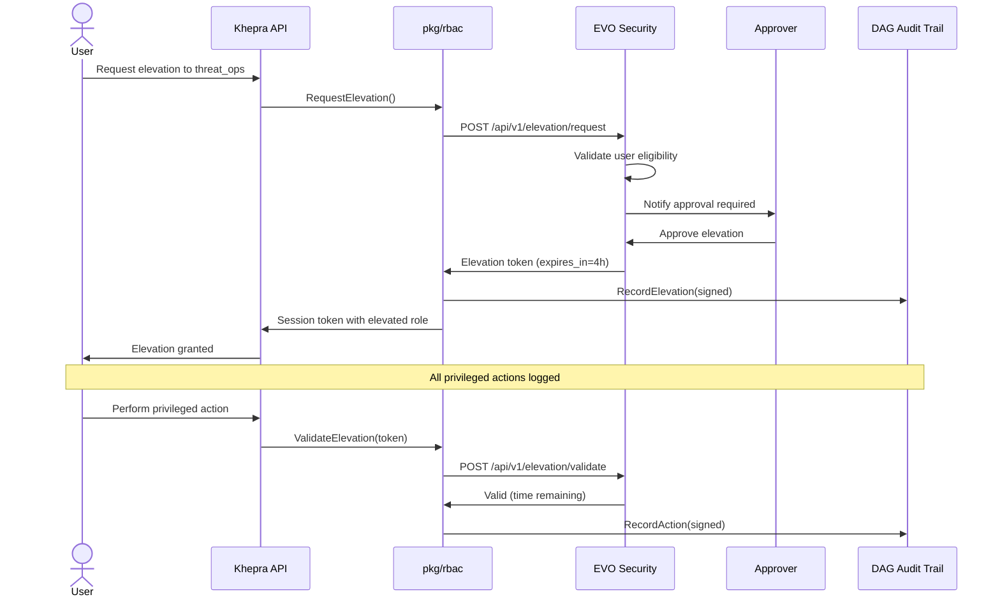

# EVO SECURITY INTEGRATION PLAN
## Khepra Protocol IAM & JIT Access Solution

**Date**: 2026-01-31  
**Status**: Approved ✅  
**Classification**: CUI // NOFORN

---

## 🎯 EXECUTIVE SUMMARY

**EVO Security** has been selected as the Identity and Access Management (IAM) solution for the Khepra Protocol, addressing both the Imohtep security requirements and the current authentication gaps in `pkg/auth`.

### Why EVO Security?

| Requirement | EVO Solution | Khepra Benefit |
|-------------|-------------|----------------|
| **JIT Access** | Technician Elevation | Native JIT capability, no custom development |
| **MFA** | Multi-factor authentication | Solves Imohtep MFA requirement |
| **SSO** | Web application SSO | Enterprise-ready authentication |
| **Least Privilege** | End User Elevation | Zero Trust compliance |
| **Network Auth** | RADIUS | Authenticates remote scanning (SSH/WinRM) |
| **Non-AWS** | Cloud-agnostic | Works in air-gapped, hybrid, cloud |

---

## 📊 EVO SECURITY CAPABILITIES

### Identity Management

```
┌─────────────────────────────────────────────────────────────────┐
│                    EVO SECURITY PLATFORM                        │
├─────────────────────────────────────────────────────────────────┤
│                                                                 │
│  ┌─────────────────────┐  ┌─────────────────────┐             │
│  │       MFA           │  │       SSO           │             │
│  │  Authentication for │  │  Web application    │             │
│  │  endpoints/machines │  │  authentication     │             │
│  └─────────────────────┘  └─────────────────────┘             │
│                                                                 │
│  ┌─────────────────────┐  ┌─────────────────────┐             │
│  │  Help Desk          │  │     RADIUS          │             │
│  │  Verification       │  │  Network device     │             │
│  │  Secure user ID     │  │  authentication     │             │
│  └─────────────────────┘  └─────────────────────┘             │
│                                                                 │
├─────────────────────────────────────────────────────────────────┤
│           PRIVILEGED ACCESS MANAGEMENT (PAM)                    │
├─────────────────────────────────────────────────────────────────┤
│                                                                 │
│  ┌─────────────────────┐  ┌─────────────────────┐             │
│  │  Technician         │  │  End User           │             │
│  │  Elevation          │  │  Elevation          │             │
│  │  Admin rights       │  │  Least privilege    │             │
│  │  control            │  │  enforcement        │             │
│  └─────────────────────┘  └─────────────────────┘             │
│                                                                 │
└─────────────────────────────────────────────────────────────────┘
```

---

## 🔧 INTEGRATION ARCHITECTURE

### High-Level Integration



### Authentication Flow



### JIT Elevation Flow



---

## 💻 IMPLEMENTATION DETAILS

### Package Structure

```
pkg/auth/
├── auth.go              # Provider interface (existing)
├── evo.go               # EVO Security provider (NEW)
├── evo_client.go        # EVO API client (NEW)
├── evo_types.go         # EVO data structures (NEW)
└── evo_test.go          # Unit tests (NEW)

pkg/rbac/
├── rbac.go              # Role definitions (existing)
├── jit.go               # JIT elevation logic (NEW)
└── jit_evo.go           # EVO-specific JIT integration (NEW)
```

### Code Implementation

#### pkg/auth/evo.go

```go
package auth

import (
    "context"
    "time"
    
    "github.com/khepra/pkg/rbac"
    "github.com/khepra/pkg/dag"
)

// EVOProvider implements the AuthProvider interface using EVO Security
type EVOProvider struct {
    client      *EVOClient
    dagRecorder *dag.Recorder
}

// NewEVOProvider creates a new EVO Security authentication provider
func NewEVOProvider(apiEndpoint, apiKey, tenantID string, dag *dag.Recorder) (*EVOProvider, error) {
    client, err := NewEVOClient(apiEndpoint, apiKey, tenantID)
    if err != nil {
        return nil, err
    }
    
    return &EVOProvider{
        client:      client,
        dagRecorder: dag,
    }, nil
}

// Authenticate validates user credentials via EVO Security
func (e *EVOProvider) Authenticate(ctx context.Context, username, password string) (*User, error) {
    // Call EVO API
    resp, err := e.client.Login(ctx, username, password)
    if err != nil {
        return nil, err
    }
    
    // Check if MFA is required
    if resp.MFARequired {
        return nil, ErrMFARequired
    }
    
    // Create user object
    user := &User{
        ID:       resp.UserID,
        Username: username,
        Email:    resp.Email,
        Roles:    resp.Roles,
        Token:    resp.Token,
    }
    
    // Record authentication in DAG
    e.dagRecorder.RecordAuthentication(ctx, user)
    
    return user, nil
}

// VerifyMFA validates MFA token via EVO Security
func (e *EVOProvider) VerifyMFA(ctx context.Context, userID, token string) (bool, error) {
    return e.client.VerifyMFA(ctx, userID, token)
}

// RequestElevation requests JIT privilege elevation via EVO Security
func (e *EVOProvider) RequestElevation(ctx context.Context, req *rbac.JITRequest) (*rbac.JITElevation, error) {
    // Call EVO Technician Elevation API
    resp, err := e.client.RequestElevation(ctx, &EVOElevationRequest{
        UserID:        req.UserID,
        TargetRole:    string(req.TargetRole),
        Justification: req.Justification,
        Duration:      req.Duration,
    })
    if err != nil {
        return nil, err
    }
    
    // Create JIT elevation object
    elevation := &rbac.JITElevation{
        ID:            resp.ElevationID,
        UserID:        req.UserID,
        TargetRole:    req.TargetRole,
        Justification: req.Justification,
        RequestedAt:   time.Now(),
        ExpiresAt:     time.Now().Add(req.Duration),
        SessionToken:  resp.Token,
        Status:        rbac.ElevationPending,
    }
    
    // Record elevation request in DAG
    dagNodeID, err := e.dagRecorder.RecordElevationRequest(ctx, elevation)
    if err != nil {
        return nil, err
    }
    elevation.DAGNodeID = dagNodeID
    
    return elevation, nil
}

// ValidateElevation checks if elevation token is still valid
func (e *EVOProvider) ValidateElevation(ctx context.Context, token string) (*rbac.JITElevation, error) {
    resp, err := e.client.ValidateElevation(ctx, token)
    if err != nil {
        return nil, err
    }
    
    return &rbac.JITElevation{
        ID:           resp.ElevationID,
        UserID:       resp.UserID,
        TargetRole:   rbac.Role(resp.Role),
        SessionToken: token,
        ExpiresAt:    resp.ExpiresAt,
        Status:       rbac.ElevationActive,
    }, nil
}

// RevokeElevation revokes an active elevation
func (e *EVOProvider) RevokeElevation(ctx context.Context, elevationID string) error {
    err := e.client.RevokeElevation(ctx, elevationID)
    if err != nil {
        return err
    }
    
    // Record revocation in DAG
    return e.dagRecorder.RecordElevationRevocation(ctx, elevationID)
}
```

#### pkg/auth/evo_client.go

```go
package auth

import (
    "bytes"
    "context"
    "encoding/json"
    "fmt"
    "net/http"
    "time"
)

// EVOClient is the HTTP client for EVO Security API
type EVOClient struct {
    baseURL    string
    apiKey     string
    tenantID   string
    httpClient *http.Client
}

// NewEVOClient creates a new EVO Security API client
func NewEVOClient(baseURL, apiKey, tenantID string) (*EVOClient, error) {
    return &EVOClient{
        baseURL:  baseURL,
        apiKey:   apiKey,
        tenantID: tenantID,
        httpClient: &http.Client{
            Timeout: 30 * time.Second,
        },
    }, nil
}

// Login authenticates a user
func (c *EVOClient) Login(ctx context.Context, username, password string) (*EVOLoginResponse, error) {
    req := &EVOLoginRequest{
        Username: username,
        Password: password,
        TenantID: c.tenantID,
    }
    
    var resp EVOLoginResponse
    err := c.doRequest(ctx, "POST", "/api/v1/auth/login", req, &resp)
    return &resp, err
}

// VerifyMFA verifies an MFA token
func (c *EVOClient) VerifyMFA(ctx context.Context, userID, token string) (bool, error) {
    req := &EVOMFARequest{
        UserID: userID,
        Token:  token,
    }
    
    var resp EVOMFAResponse
    err := c.doRequest(ctx, "POST", "/api/v1/mfa/verify", req, &resp)
    return resp.Valid, err
}

// RequestElevation requests privilege elevation
func (c *EVOClient) RequestElevation(ctx context.Context, req *EVOElevationRequest) (*EVOElevationResponse, error) {
    var resp EVOElevationResponse
    err := c.doRequest(ctx, "POST", "/api/v1/elevation/request", req, &resp)
    return &resp, err
}

// ValidateElevation validates an elevation token
func (c *EVOClient) ValidateElevation(ctx context.Context, token string) (*EVOElevationValidateResponse, error) {
    req := &EVOElevationValidateRequest{
        Token: token,
    }
    
    var resp EVOElevationValidateResponse
    err := c.doRequest(ctx, "POST", "/api/v1/elevation/validate", req, &resp)
    return &resp, err
}

// RevokeElevation revokes an elevation
func (c *EVOClient) RevokeElevation(ctx context.Context, elevationID string) error {
    req := &EVOElevationRevokeRequest{
        ElevationID: elevationID,
    }
    
    return c.doRequest(ctx, "POST", "/api/v1/elevation/revoke", req, nil)
}

// doRequest performs an HTTP request to the EVO API
func (c *EVOClient) doRequest(ctx context.Context, method, path string, body, result interface{}) error {
    var reqBody []byte
    var err error
    
    if body != nil {
        reqBody, err = json.Marshal(body)
        if err != nil {
            return fmt.Errorf("failed to marshal request: %w", err)
        }
    }
    
    req, err := http.NewRequestWithContext(ctx, method, c.baseURL+path, bytes.NewReader(reqBody))
    if err != nil {
        return fmt.Errorf("failed to create request: %w", err)
    }
    
    req.Header.Set("Content-Type", "application/json")
    req.Header.Set("Authorization", "Bearer "+c.apiKey)
    req.Header.Set("X-Tenant-ID", c.tenantID)
    
    resp, err := c.httpClient.Do(req)
    if err != nil {
        return fmt.Errorf("request failed: %w", err)
    }
    defer resp.Body.Close()
    
    if resp.StatusCode >= 400 {
        var errResp EVOErrorResponse
        json.NewDecoder(resp.Body).Decode(&errResp)
        return fmt.Errorf("EVO API error: %s", errResp.Message)
    }
    
    if result != nil {
        if err := json.NewDecoder(resp.Body).Decode(result); err != nil {
            return fmt.Errorf("failed to decode response: %w", err)
        }
    }
    
    return nil
}
```

#### pkg/auth/evo_types.go

```go
package auth

import "time"

// EVOLoginRequest is the login request payload
type EVOLoginRequest struct {
    Username string `json:"username"`
    Password string `json:"password"`
    TenantID string `json:"tenant_id"`
}

// EVOLoginResponse is the login response payload
type EVOLoginResponse struct {
    UserID      string   `json:"user_id"`
    Email       string   `json:"email"`
    Roles       []string `json:"roles"`
    Token       string   `json:"token"`
    MFARequired bool     `json:"mfa_required"`
}

// EVOMFARequest is the MFA verification request
type EVOMFARequest struct {
    UserID string `json:"user_id"`
    Token  string `json:"token"`
}

// EVOMFAResponse is the MFA verification response
type EVOMFAResponse struct {
    Valid bool `json:"valid"`
}

// EVOElevationRequest is the elevation request payload
type EVOElevationRequest struct {
    UserID        string        `json:"user_id"`
    TargetRole    string        `json:"target_role"`
    Justification string        `json:"justification"`
    Duration      time.Duration `json:"duration"`
}

// EVOElevationResponse is the elevation response payload
type EVOElevationResponse struct {
    ElevationID string `json:"elevation_id"`
    Token       string `json:"token"`
    ExpiresAt   time.Time `json:"expires_at"`
    Status      string `json:"status"` // "pending", "approved", "denied"
}

// EVOElevationValidateRequest is the elevation validation request
type EVOElevationValidateRequest struct {
    Token string `json:"token"`
}

// EVOElevationValidateResponse is the elevation validation response
type EVOElevationValidateResponse struct {
    ElevationID string    `json:"elevation_id"`
    UserID      string    `json:"user_id"`
    Role        string    `json:"role"`
    ExpiresAt   time.Time `json:"expires_at"`
    Valid       bool      `json:"valid"`
}

// EVOElevationRevokeRequest is the elevation revocation request
type EVOElevationRevokeRequest struct {
    ElevationID string `json:"elevation_id"`
}

// EVOErrorResponse is the error response payload
type EVOErrorResponse struct {
    Message string `json:"message"`
    Code    string `json:"code"`
}
```

---

## 📋 CONFIGURATION

### Environment Variables

```bash
# EVO Security Configuration
EVO_API_ENDPOINT=https://api.evosecurity.com
EVO_API_KEY=evo_live_1234567890abcdef
EVO_TENANT_ID=khepra-protocol-prod

# EVO Feature Flags
EVO_MFA_ENABLED=true
EVO_JIT_ENABLED=true
EVO_SSO_ENABLED=true
EVO_RADIUS_ENABLED=true

# EVO Elevation Settings
EVO_DEFAULT_ELEVATION_DURATION=4h
EVO_MAX_ELEVATION_DURATION=8h
EVO_REQUIRE_APPROVAL=true
```

### Configuration File

```yaml
# config/auth.yaml
auth:
  provider: evo
  evo:
    api_endpoint: ${EVO_API_ENDPOINT}
    api_key: ${EVO_API_KEY}
    tenant_id: ${EVO_TENANT_ID}
    
    mfa:
      enabled: true
      required_for_elevation: true
    
    jit:
      enabled: true
      default_duration: 4h
      max_duration: 8h
      require_approval: true
      approver_roles:
        - admin
        - security_manager
    
    sso:
      enabled: true
      providers:
        - active_directory
        - okta
    
    radius:
      enabled: true
      server: radius.evosecurity.com
      port: 1812
```

---

## 🧪 TESTING PLAN

### Unit Tests

```bash
# Test EVO provider
go test -v ./pkg/auth -run TestEVOProvider

# Test JIT elevation
go test -v ./pkg/rbac -run TestJITElevation

# Test MFA verification
go test -v ./pkg/auth -run TestMFAVerification
```

### Integration Tests

```bash
# Test full authentication flow
go test -v ./test/integration -run TestEVOAuthentication

# Test JIT elevation workflow
go test -v ./test/integration -run TestJITElevationWorkflow

# Test SSO integration
go test -v ./test/integration -run TestSSOIntegration
```

### Manual Testing Checklist

- [ ] User can log in with username/password
- [ ] MFA challenge is presented when enabled
- [ ] MFA token is verified correctly
- [ ] User can request JIT elevation
- [ ] Approver receives elevation notification
- [ ] Elevation is granted after approval
- [ ] Elevation token expires after duration
- [ ] Elevated actions are logged to DAG
- [ ] Elevation can be revoked manually
- [ ] SSO works with Active Directory
- [ ] RADIUS authentication works for network devices

---

## 📊 DEPLOYMENT CHECKLIST

### Pre-Deployment

- [ ] Obtain EVO Security account and API credentials
- [ ] Configure EVO tenant for Khepra Protocol
- [ ] Set up user roles in EVO (threat_ops, compliance, devsecops, etc.)
- [ ] Configure MFA policies in EVO
- [ ] Configure elevation approval workflow in EVO
- [ ] Test EVO API connectivity from Khepra environment

### Deployment

- [ ] Deploy updated `pkg/auth` with EVO provider
- [ ] Deploy updated `pkg/rbac` with JIT support
- [ ] Update configuration files with EVO credentials
- [ ] Migrate existing users to EVO (if applicable)
- [ ] Enable MFA for all admin users
- [ ] Configure elevation approvers

### Post-Deployment

- [ ] Verify all users can authenticate
- [ ] Verify MFA is working
- [ ] Verify JIT elevation workflow
- [ ] Monitor EVO API performance
- [ ] Review DAG logs for authentication events
- [ ] Conduct user training on JIT elevation

---

## 🔒 SECURITY CONSIDERATIONS

### API Key Management

- Store EVO API key in AWS Secrets Manager (or equivalent)
- Rotate API key every 90 days
- Use separate API keys for dev/staging/prod
- Never commit API keys to Git

### Session Security

- EVO session tokens are short-lived (4 hours default)
- Tokens are invalidated on logout
- Tokens are invalidated on password change
- Tokens are invalidated on role change

### Audit Logging

- All authentication events logged to DAG
- All elevation requests logged to DAG
- All elevation approvals logged to DAG
- All elevation revocations logged to DAG
- All MFA verifications logged to DAG

---

## 📈 SUCCESS METRICS

| Metric | Target | Measurement |
|--------|--------|-------------|
| Authentication latency | <500ms | EVO API response time |
| MFA verification latency | <200ms | EVO API response time |
| JIT elevation approval time | <5 minutes | Time from request to approval |
| Elevation token validation | <100ms | EVO API response time |
| Failed authentication rate | <1% | Failed logins / total logins |
| MFA adoption rate | 100% | Users with MFA enabled / total users |

---

## 🚀 NEXT STEPS

### Immediate (Week 1)

1. **Obtain EVO Security Account**
   - Sign up for EVO Security trial/license
   - Configure tenant for Khepra Protocol
   - Obtain API credentials

2. **Implement EVO Provider**
   - Create `pkg/auth/evo.go`
   - Create `pkg/auth/evo_client.go`
   - Create `pkg/auth/evo_types.go`
   - Write unit tests

3. **Update RBAC Package**
   - Create `pkg/rbac/jit.go`
   - Create `pkg/rbac/jit_evo.go`
   - Integrate with DAG for audit logging

### Short-Term (Week 2-3)

1. **Integration Testing**
   - Test authentication flow
   - Test MFA verification
   - Test JIT elevation workflow
   - Test SSO integration

2. **Documentation**
   - API documentation for EVO integration
   - User guide for JIT elevation
   - Admin guide for elevation approvals

3. **Deployment Preparation**
   - Create deployment scripts
   - Update configuration templates
   - Prepare user migration plan

### Medium-Term (Week 4-6)

1. **Production Deployment**
   - Deploy to staging environment
   - Conduct user acceptance testing
   - Deploy to production
   - Monitor and optimize

2. **User Training**
   - Train admins on elevation approval
   - Train users on JIT elevation request
   - Create video tutorials

---

**Document Version**: 1.0  
**Last Updated**: 2026-01-31  
**Next Review**: After EVO Security account setup  
**Classification**: CUI // NOFORN
