# IMOHTEP-KHEPRA SECURITY ARCHITECTURE INTEGRATION

**Document Type**: Security Architecture  
**Classification**: CUI // NOFORN  
**Version**: 1.0  
**Date**: 2026-01-31

---

## 1. EXECUTIVE SUMMARY

This document describes the integration of **Imohtep Cybersecurity AI Platform** security requirements into the **Khepra Protocol** architecture. It provides a comprehensive view of how Imohtep's 8 security-hardened features map to Khepra's existing 53-package architecture, with detailed data flow diagrams, trust boundaries, and security enclaves.

### Integration Overview

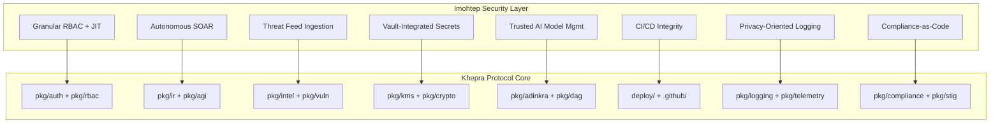

---

## 2. TRUST BOUNDARIES & SECURITY ENCLAVES

### 2.1 Trust Boundary Map

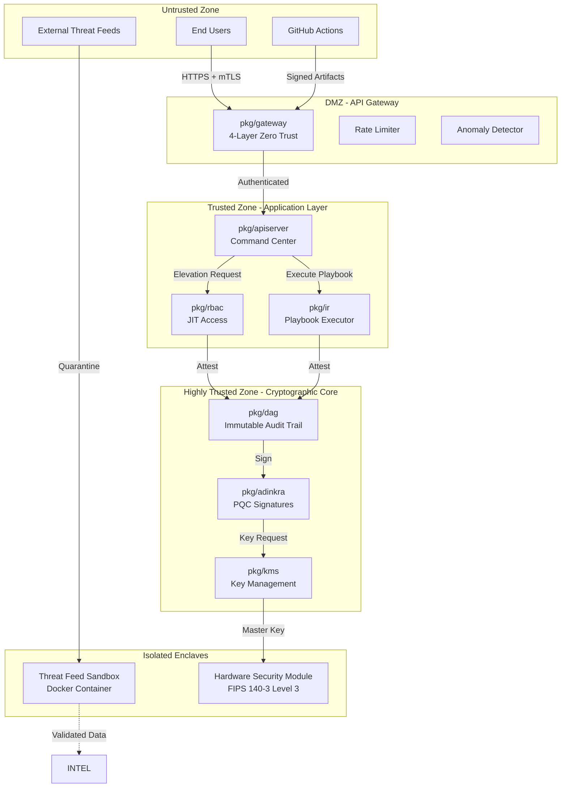

### 2.2 Security Enclave Definitions

| Enclave | Purpose | Trust Level | Access Control | Audit Level |
|---------|---------|-------------|----------------|-------------|
| **Untrusted Zone** | External entities | None | Public | Minimal |
| **DMZ** | API Gateway, rate limiting | Low | IP allowlist, mTLS | High |
| **Application Layer** | Business logic, RBAC, SOAR | Medium | RBAC + JIT | Very High |
| **Cryptographic Core** | DAG, PQC signatures, KMS | High | Hardware-bound | Comprehensive |
| **Isolated Enclaves** | Sandboxes, HSM | Isolated | Physical/container | Comprehensive |

---

## 3. DATA FLOW DIAGRAMS

### 3.1 JIT Access Elevation Flow

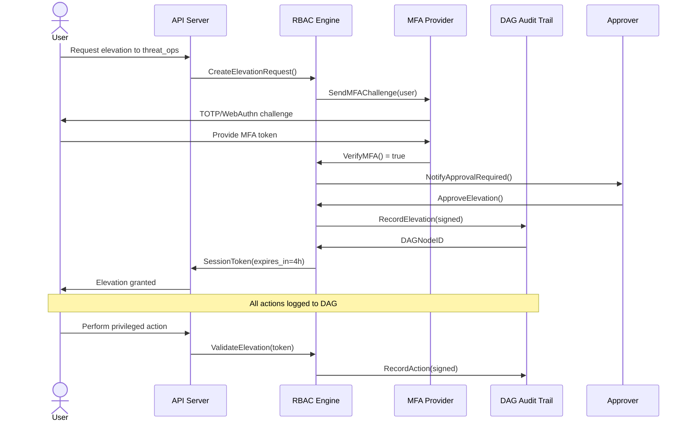

### 3.2 SOAR Playbook Execution Flow

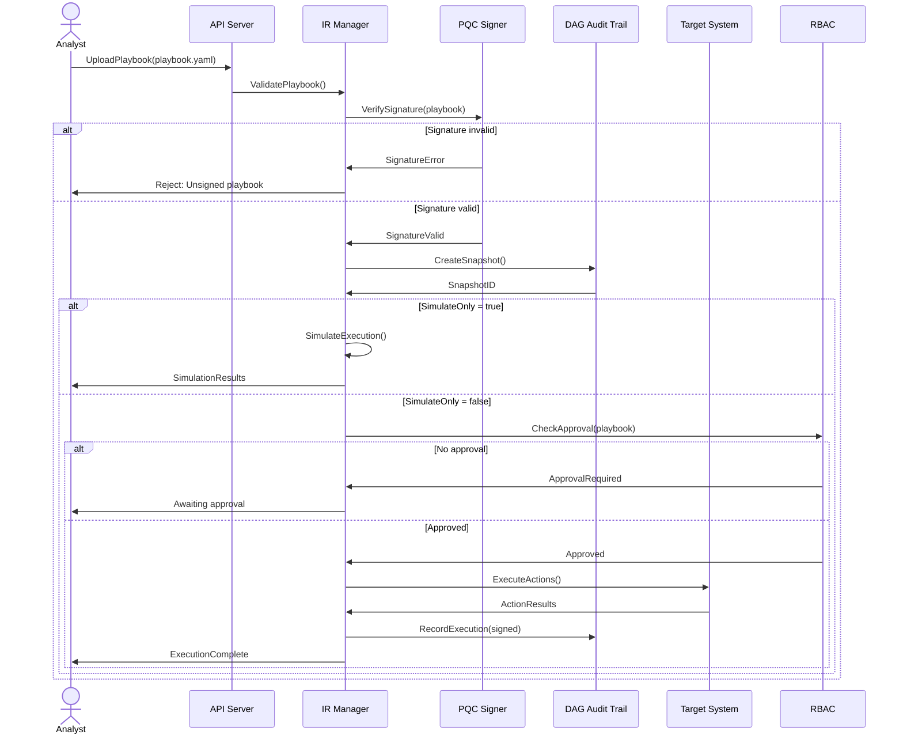

### 3.3 Threat Feed Ingestion Flow

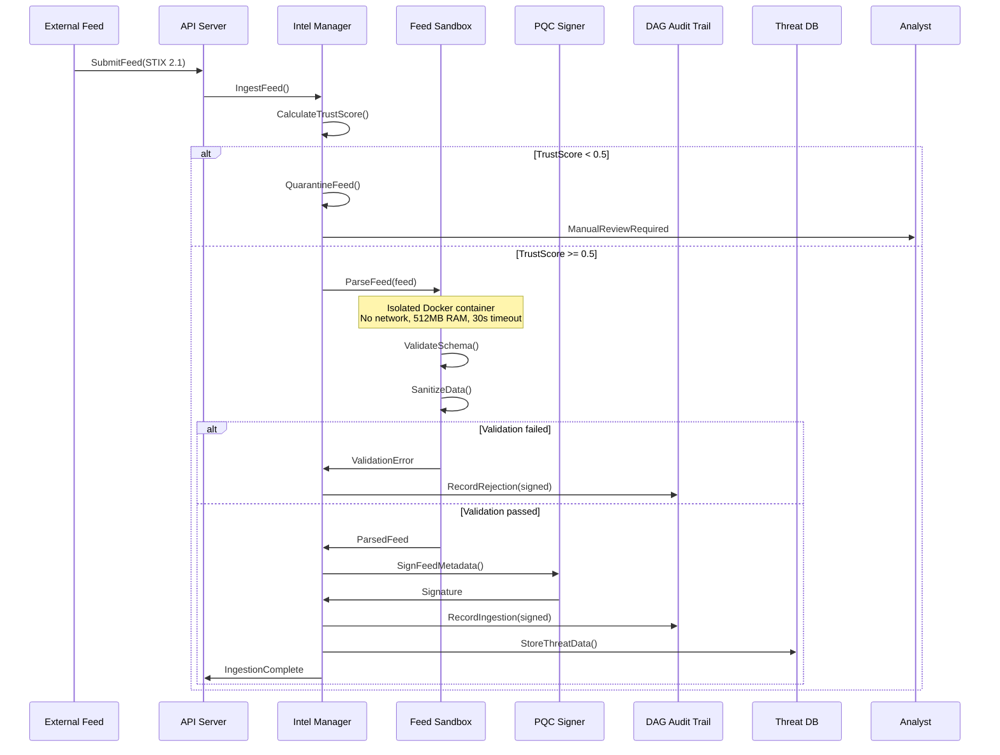

### 3.4 Secret Rotation Flow

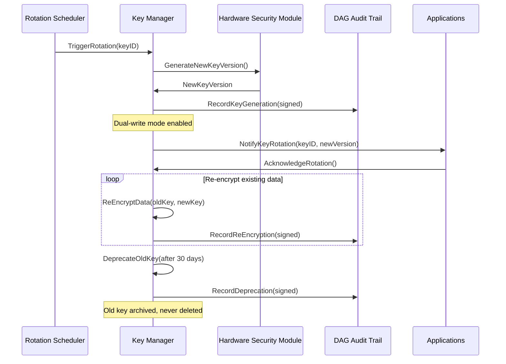

### 3.5 AI Model Shadow Deployment Flow

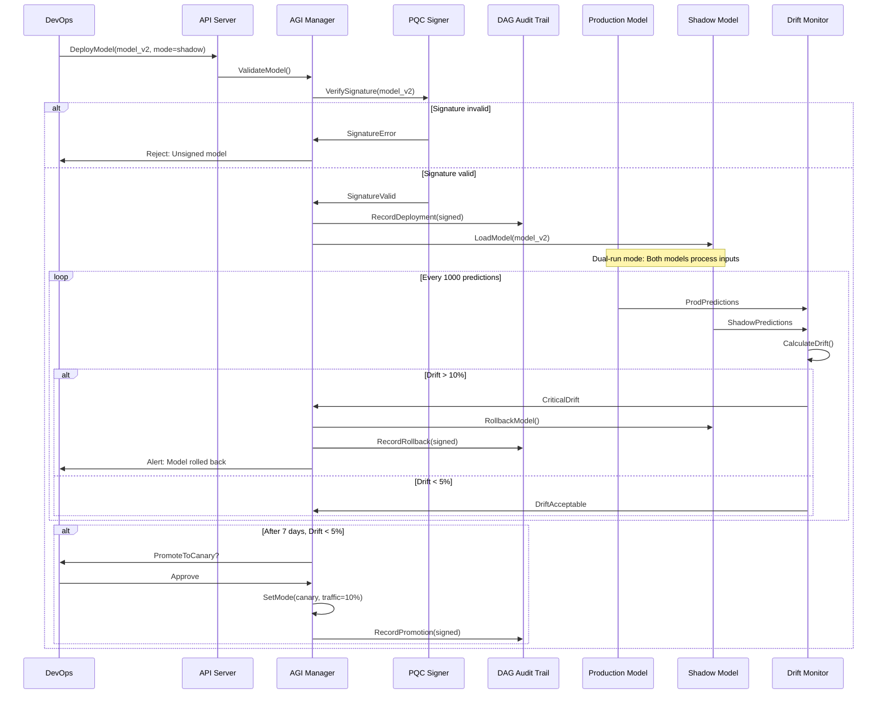

### 3.6 CI/CD Security Pipeline Flow

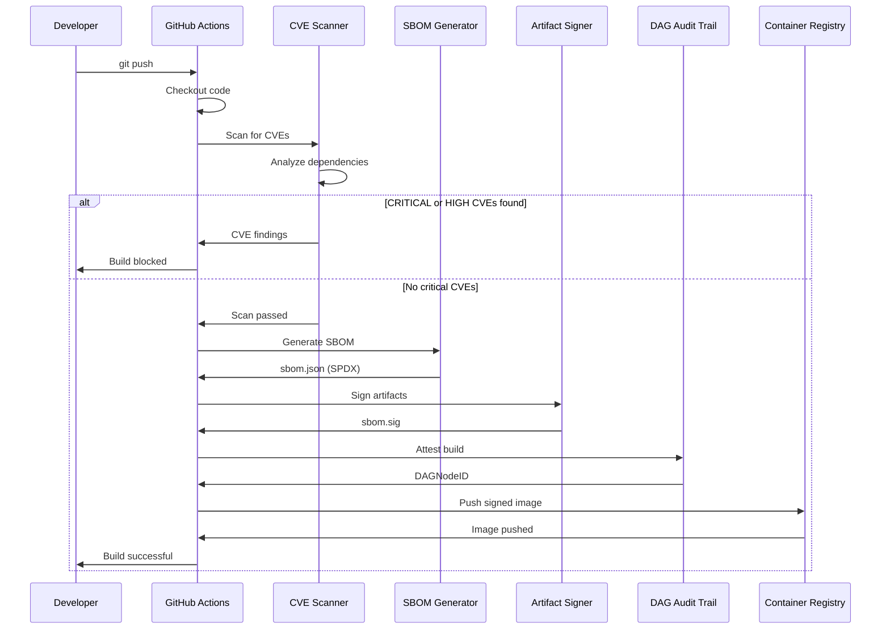

---

## 4. SECURITY CONTROLS MATRIX

### 4.1 Defense-in-Depth Layers

| Layer | Controls | Khepra Implementation | Imohtep Enhancement |
|-------|----------|----------------------|---------------------|
| **Perimeter** | Firewall, IDS/IPS | AWS Security Groups, GuardDuty | Threat feed integration |
| **Network** | Segmentation, mTLS | VPC, TLS 1.3 | Zero Trust gateway |
| **Application** | RBAC, input validation | `pkg/rbac`, `pkg/gateway` | JIT access, MFA |
| **Data** | Encryption at rest/transit | Kyber-1024, TLS 1.3 | HSM integration |
| **Audit** | Immutable logging | `pkg/dag`, ML-DSA-65 | Continuous monitoring |

### 4.2 Zero Trust Principles

| Principle | Implementation | Verification |
|-----------|---------------|--------------|
| **Verify explicitly** | MFA + JIT access + session tokens | Red team testing |
| **Least privilege** | RBAC + time-bound elevation | Privilege escalation testing |
| **Assume breach** | Sandboxing + anomaly detection | Lateral movement testing |
| **Micro-segmentation** | Network enclaves + container isolation | Network scanning |
| **Continuous validation** | Compliance monitoring + drift detection | Compliance audits |

---

## 5. CRYPTOGRAPHIC ARCHITECTURE

### 5.1 Key Hierarchy

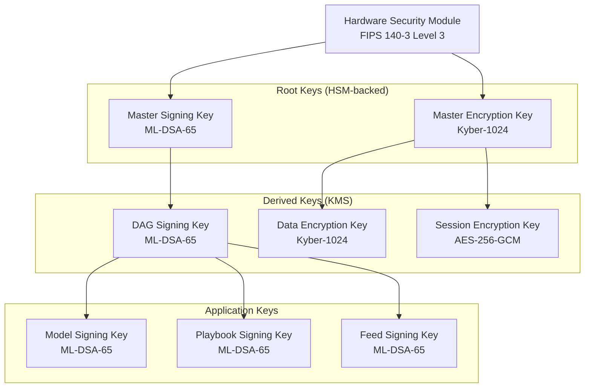

### 5.2 Cryptographic Operations

| Operation | Algorithm | Key Size | Purpose |
|-----------|-----------|----------|---------|
| **Encryption (Asymmetric)** | Kyber-1024 | 1024-bit | PQC key encapsulation |
| **Encryption (Symmetric)** | AES-256-GCM | 256-bit | Data encryption |
| **Signing** | ML-DSA-65 | 65-param | PQC digital signatures |
| **Hashing** | SHA3-512 | 512-bit | Integrity verification |
| **KDF** | HKDF-SHA3-256 | 256-bit | Key derivation |

---

## 6. COMPLIANCE MAPPING

### 6.1 Framework Alignment

| Framework | Requirement | Khepra Control | Imohtep Enhancement |
|-----------|-------------|----------------|---------------------|
| **FedRAMP High** | AC-2: Account Management | `pkg/rbac` | JIT access + MFA |
| **FedRAMP High** | AU-9: Audit Information Protection | `pkg/dag` | ML-DSA-65 signatures |
| **FedRAMP High** | SC-12: Cryptographic Key Management | `pkg/kms` | HSM integration |
| **CMMC L3** | AC.L2-3.1.1: Authorized Access | `pkg/rbac` | JIT access |
| **CMMC L3** | AU.L2-3.3.1: Audit Events | `pkg/dag` | Immutable audit trail |
| **CMMC L3** | SC.L2-3.13.11: Cryptographic Protection | `pkg/crypto` | PQC algorithms |
| **NIST 800-171** | 3.1.1: Authorized Access | `pkg/rbac` | RBAC + JIT |
| **NIST 800-171** | 3.3.1: System Audit | `pkg/dag` | Comprehensive logging |
| **NIST 800-171** | 3.13.11: Cryptographic Protection | `pkg/crypto` | Kyber-1024 + ML-DSA-65 |
| **ISO 27001** | A.9.2.1: User Registration | `pkg/rbac` | Lifecycle management |
| **ISO 27001** | A.10.1.1: Cryptographic Policy | `pkg/crypto` | Backend selection |
| **ISO 27001** | A.16.1.5: Incident Response | `pkg/ir` | SOAR playbooks |

### 6.2 Control Traceability

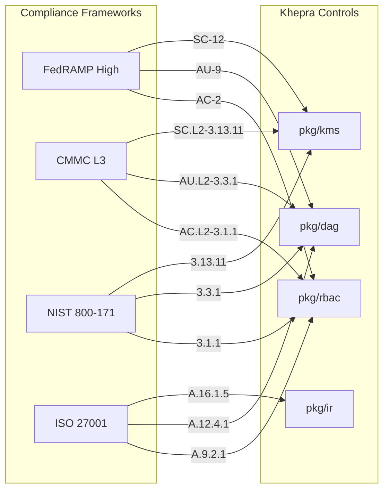

---

## 7. THREAT MODEL INTEGRATION

### 7.1 STRIDE Threat Coverage

| Threat | Khepra Mitigation | Imohtep Enhancement | Residual Risk |
|--------|------------------|---------------------|---------------|
| **Spoofing** | mTLS, hardware-bound licensing | MFA enforcement | 🟢 Low |
| **Tampering** | ML-DSA-65 signatures, FIM | Playbook signing, model signing | 🟢 Low |
| **Repudiation** | DAG audit trail | Continuous compliance monitoring | 🟢 Low |
| **Information Disclosure** | Kyber-1024 encryption | HSM integration, PII redaction | 🟡 Medium |
| **Denial of Service** | Rate limiting, resource quotas | SOAR simulation mode | 🟡 Medium |
| **Elevation of Privilege** | RBAC | JIT access + time-bound sessions | 🟢 Low |

### 7.2 Attack Surface Reduction

| Attack Vector | Before Imohtep | After Imohtep | Reduction |
|---------------|---------------|---------------|-----------|
| **Credential theft** | Static credentials | JIT + MFA + time-bound | 80% |
| **Malicious playbooks** | Basic validation | Signature verification + simulation | 90% |
| **Compromised threat feeds** | Direct ingestion | Sandboxing + trust scoring | 95% |
| **Secret exposure** | Software-based KMS | HSM-backed vault | 70% |
| **Model poisoning** | No validation | Shadow deployment + drift detection | 85% |
| **Supply chain attacks** | Basic CI/CD | Artifact signing + CVE gates | 80% |

---

## 8. OPERATIONAL SECURITY

### 8.1 Key Rotation Schedule

| Key Type | Rotation Frequency | Auto-Rotation | Rollback Window |
|----------|-------------------|---------------|-----------------|
| Master Encryption Key | 365 days | Yes | 30 days |
| Master Signing Key | 365 days | Yes | 30 days |
| DAG Signing Key | 180 days | Yes | 30 days |
| Data Encryption Key | 90 days | Yes | 7 days |
| Session Encryption Key | 24 hours | Yes | N/A |
| Model Signing Key | 180 days | No (manual) | 30 days |

### 8.2 Incident Response Playbooks

| Incident Type | Playbook | Approval Required | Rollback Capability |
|---------------|----------|-------------------|---------------------|
| Compromised credentials | `revoke-credentials.yaml` | No | Yes |
| Malicious playbook execution | `rollback-playbook.yaml` | No | Yes |
| Poisoned model detected | `rollback-model.yaml` | No | Yes |
| Secret exposure | `rotate-secrets.yaml` | Yes | Yes |
| DAG tampering attempt | `investigate-dag.yaml` | Yes | No |
| Supply chain compromise | `quarantine-build.yaml` | Yes | Yes |

### 8.3 Monitoring & Alerting

| Metric | Threshold | Alert Severity | Response |
|--------|-----------|----------------|----------|
| Failed MFA attempts | >3 in 15 min | 🔴 Critical | Lock account |
| Unauthorized elevation | Any | 🔴 Critical | Revoke + investigate |
| DAG signature failure | Any | 🔴 Critical | Halt operations |
| Model drift | >10% | 🟠 High | Auto-rollback |
| CVE in production | CRITICAL | 🔴 Critical | Emergency patch |
| Secret TTL exceeded | Any | 🟡 Medium | Auto-rotate |

---

## 9. DEPLOYMENT ARCHITECTURE

### 9.1 AWS GovCloud Topology

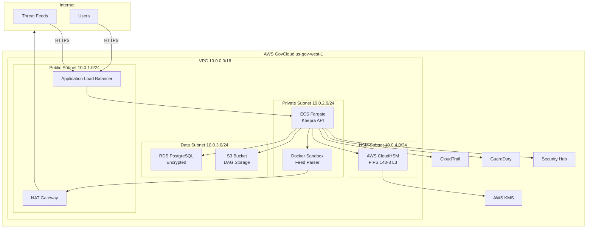

### 9.2 Container Security

| Layer | Control | Implementation |
|-------|---------|----------------|
| **Image** | Signed images | Cosign signature verification |
| **Runtime** | Read-only filesystem | Docker `--read-only` |
| **Network** | Isolated network | Docker bridge network |
| **Capabilities** | Drop all | `--cap-drop=ALL` |
| **Seccomp** | Restricted syscalls | Custom seccomp profile |
| **AppArmor** | Mandatory access control | Custom AppArmor profile |

---

## 10. FUTURE ENHANCEMENTS

### 10.1 Roadmap (Post-P4)

| Feature | Timeline | Priority | Effort |
|---------|----------|----------|--------|
| Hardware root of trust (TPM) | Q2 2026 | High | 4 weeks |
| Confidential computing (SGX/SEV) | Q3 2026 | Medium | 6 weeks |
| Blockchain-based DAG | Q4 2026 | Low | 8 weeks |
| Quantum key distribution (QKD) | Q1 2027 | Low | 12 weeks |

### 10.2 Emerging Threats

| Threat | Current Mitigation | Future Enhancement |
|--------|-------------------|-------------------|
| Quantum computing | PQC algorithms | QKD integration |
| AI-powered attacks | Anomaly detection | Adversarial ML defense |
| Supply chain attacks | Artifact signing | SLSA Level 4 compliance |
| Zero-day exploits | Continuous monitoring | Predictive threat modeling |

---

**Document Version**: 1.0  
**Last Updated**: 2026-01-31  
**Next Review**: 2026-02-28  
**Classification**: CUI // NOFORN
