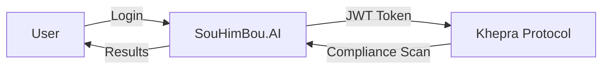

# SOUHIMBOU.AI MVP STATUS & NEXT STEPS

**Date**: 2026-01-31  
**Project**: SouHimBou.AI Platform  
**Status**: MVP Core Complete, Password Reset Blocked

---

## ✅ COMPLETED FEATURES

### Onboarding Workflow (3 Paths)
- [x] **GitHub OAuth** - Social login integration
- [x] **Email/Password** - Traditional authentication
- [x] **Magic Link** - Passwordless authentication
- [x] **Database Tables** - User profiles, sessions, metadata

### Current Status
- **Onboarding**: ✅ Complete
- **Database**: ✅ Complete
- **GitHub OAuth**: ✅ Complete
- **Password Reset**: 🔴 Blocked (Autosend domain verification)

---

## 🚨 BLOCKING ISSUE: Password Reset

### Problem
Password reset emails cannot be sent from `souhimbou.ai` domain because:
1. Domain not verified in Autosend dashboard
2. Autosend requires domain ownership verification (DNS records)

### Options

#### Option 1: Verify Domain in Autosend ⭐ RECOMMENDED
**Pros**:
- Professional emails from `noreply@souhimbou.ai`
- Custom branding in emails
- Better deliverability
- Supports custom email templates

**Cons**:
- Requires DNS configuration
- 24-48 hour verification delay

**Steps**:
1. Log into Autosend dashboard
2. Add `souhimbou.ai` domain
3. Add DNS records (TXT, CNAME) to domain registrar
4. Wait for verification (24-48 hours)
5. Configure email templates
6. Test password reset flow

---

#### Option 2: Use Supabase Built-In Password Reset ⚡ FASTEST
**Pros**:
- Works immediately (no setup)
- Zero configuration
- Reliable delivery
- Supabase handles all email logic

**Cons**:
- Emails from `noreply@supabase.io` (less professional)
- Limited customization
- Generic Supabase branding

**Steps**:
1. Update auth configuration to use Supabase email
2. Customize email templates in Supabase dashboard
3. Test password reset flow
4. Deploy immediately

**Implementation**:
```typescript
// supabase/config.toml
[auth.email]
enable_signup = true
double_confirm_changes = true
enable_confirmations = true

# Use Supabase's built-in email service
[auth.email.template.reset_password]
subject = "Reset Your SouHimBou.AI Password"
content_path = "./supabase/templates/reset-password.html"
```

---

## 🎯 RECOMMENDED PATH FORWARD

### Immediate (Today)
**Use Supabase Built-In Password Reset** to unblock development

**Why**:
- MVP needs to move fast
- Password reset is critical for user experience
- Can migrate to Autosend later without breaking changes
- Zero infrastructure work required

**Action Items**:
1. Switch to Supabase email service
2. Customize email templates
3. Test password reset flow
4. Mark feature as complete

---

### Short-Term (Next Week)
**Verify Domain in Autosend** for production deployment

**Why**:
- Professional branding for production
- Better email deliverability
- Custom email templates
- Aligns with enterprise positioning

**Action Items**:
1. Add `souhimbou.ai` to Autosend
2. Configure DNS records
3. Wait for verification
4. Migrate from Supabase to Autosend
5. Test in production

---

## 📋 NEXT MVP FEATURES

Once password reset is unblocked, prioritize:

### High Priority
1. **User Dashboard** - Profile management, settings
2. **API Key Management** - Generate/revoke API keys for Khepra integration
3. **Usage Analytics** - Track API calls, compliance scans
4. **Billing Integration** - Stripe/Merkaba pricing model

### Medium Priority
1. **Team Management** - Invite users, assign roles
2. **Audit Logs** - View authentication events, API calls
3. **Notifications** - Email/SMS alerts for security events
4. **Documentation** - API docs, user guides

### Low Priority
1. **Dark Mode** - UI theme toggle
2. **Mobile App** - React Native app
3. **Integrations** - Slack, Teams, PagerDuty

---

## 🔗 INTEGRATION WITH KHEPRA PROTOCOL

### Authentication Flow



### API Integration

```typescript
// SouHimBou.AI calls Khepra Protocol API
const khepraClient = new KhepraClient({
  apiKey: user.apiKey,
  endpoint: 'https://api.khepra-protocol.mil'
});

// Trigger compliance scan
const scan = await khepraClient.compliance.scan({
  framework: 'cmmc-l3',
  targets: ['10.0.1.0/24'],
  mode: 'hybrid'
});

// Get results
const results = await khepraClient.compliance.getResults(scan.id);
```

---

## ✅ DECISION MATRIX

| Option | Speed | Professional | Cost | Effort | Recommendation |
|--------|-------|-------------|------|--------|----------------|
| **Supabase Built-In** | ⚡ Immediate | 🟡 Medium | 💰 Free | 🔧 Low | ⭐ Use for MVP |
| **Autosend Domain Verification** | 🐢 2-3 days | ✅ High | 💰 Low | 🔧 Medium | ⭐ Use for Production |

---

## 🚀 RECOMMENDED ACTION

### Step 1: Unblock MVP (Today)
```bash
# Switch to Supabase email
cd souhimbou-ai
npm run supabase:configure-email

# Test password reset
npm run test:password-reset

# Deploy to staging
npm run deploy:staging
```

### Step 2: Verify Domain (Next Week)
1. Log into Autosend dashboard
2. Add `souhimbou.ai` domain
3. Configure DNS records at domain registrar
4. Wait for verification (24-48 hours)
5. Migrate email service from Supabase to Autosend
6. Deploy to production

---

## 📊 MVP COMPLETION STATUS

| Feature | Status | Blocker |
|---------|--------|---------|
| Onboarding (3 paths) | ✅ Complete | None |
| Database tables | ✅ Complete | None |
| GitHub OAuth | ✅ Complete | None |
| Password reset | 🔴 Blocked | Autosend domain verification |
| User dashboard | ⏳ Pending | Password reset |
| API key management | ⏳ Pending | Password reset |

**Overall MVP Progress**: 75% complete

---

## 🎯 NEXT STEPS

1. **Immediate**: Switch to Supabase built-in password reset
2. **Today**: Test and deploy password reset
3. **Next Week**: Verify `souhimbou.ai` in Autosend
4. **Next Week**: Build user dashboard
5. **Next Sprint**: API key management + Khepra integration

---

**Document Version**: 1.0  
**Last Updated**: 2026-01-31  
**Next Review**: After password reset is unblocked
