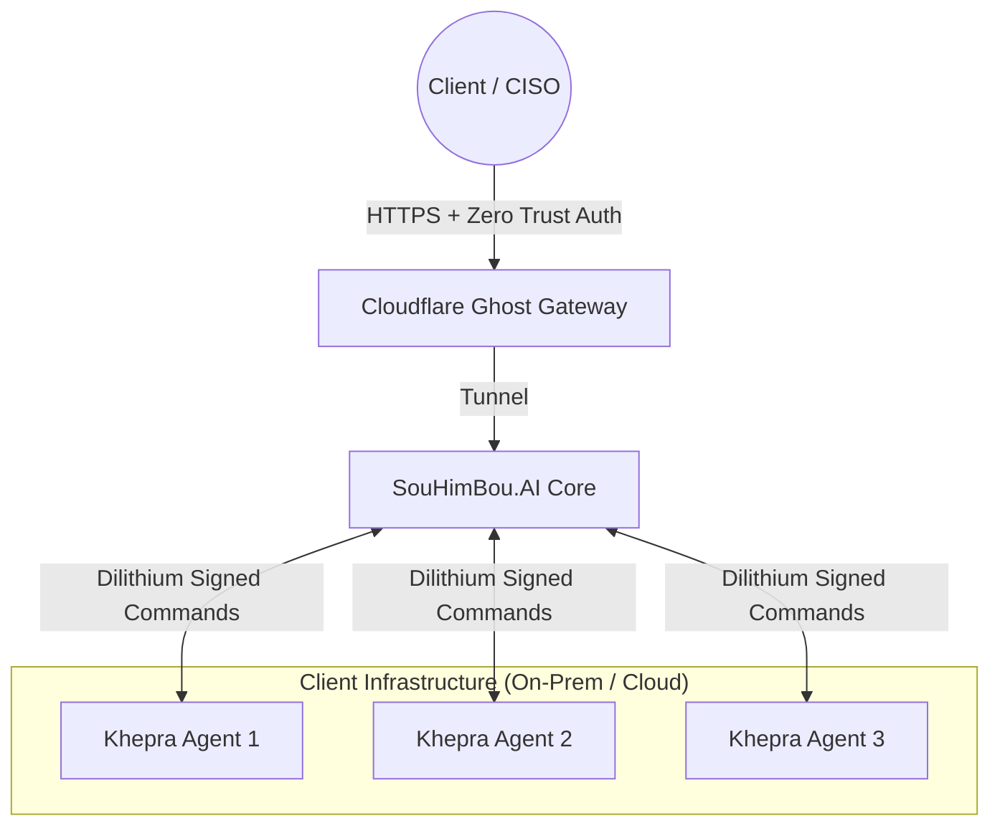

# SouHimBou.AI: The Application Interface (Deployment Model)

## Overview
In the Khepra ecosystem, the relationship between the components is defined by the **"Father & Son"** architecture.

*   **SouHimBou.AI (The Son)**: The public face—a super-polymorphic compliance platform and "Ghost Command & Control" (C2) interface. It is the "brain" that clients interact with.
*   **Khepra Protocol (The Father)**: The hidden protector—a Post-Quantum Cryptography (PQC) layer and "Shadow OS" that ensures the integrity, secrecy, and survival of the platform. It is the "muscle" running on endpoints.

Khepra acts as a **Secret Protector Backdoor** and **Integrity Engine**. If SouHimBou is the body, Khepra is the immune system and the conscience.

This architecture enables a **Hybrid Deployment** model where the client's infrastructure is secured on-premise, but managed via a secure, "invisible" cloud gateway.

## The Interaction Flow

## 1. The Client Experience ("The Cockpit")
Clients never interact with the raw Khepra CLI or backend logs. instead, they access `https://souhimbou.ai`:

1.  **Access**: They authenticate via **Cloudflare Zero Trust** (e.g., Email OTP or Hardware Key), passing through the "Ghost Gateway".
2.  **Visualization**: They see a "God's Eye View" of their entire fleet (Servers, Laptops, Cloud Instances).
    -   *Example*: "3 Critical STIG Violations detected in Sector 7."
3.  **Command**: They use natural language with the **Codex Swarm** to execute complex operations.
    -   *User Input*: "Remediate all non-compliant Windows registries."
    -   *SouHimBou Action*: Translates this into signed Khepra instruction sets.

## 2. The Backend Mechanics ("The Ghost Wire")
How does the Cloud talk to the Agents securely?

-   **Polymorphic API**: SouHimBou exposes a dynamic API endpoint (hidden behind the Ghost Gateway) that Khepra Agents poll via a secure heartbeat.
-   **Adinkra Security**:
    -   **Downlink**: Commands from SouHimBou to Agents are signed with **Dilithium3** keys. Agents verify the signature before execution.
    -   **Uplink**: Intel alerts from Agents to SouHimBou are encrypted (Kyber) and woven (Nkyinkyim) to look like random noise to traffic analyzers.

## 3. Why This Model? (The Palantir-Killer Edge)
-   **No Attack Surface**: The interface is invisible to the public internet (Ghost).
-   **Zero Touch**: Clients deploy the Khepra Agent once; everything else is managed remotely via SouHimBou.
-   **Compliance-First**: The interface is essentially a real-time audit report. Clients can download "Audit Ready" artifacts directly from the UI.
