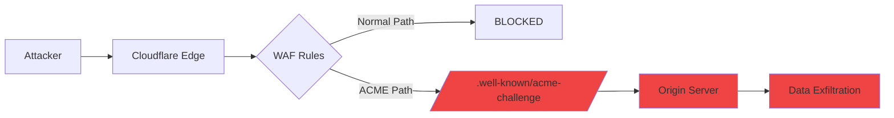

# Cloudflare WAF Zero-Day Case Study

## Threat Intelligence Brief

**Date**: January 2026  
**Source**: [LinkedIn Security Alert](https://lnkd.in/g4WJu2MD)  
**Severity**: CRITICAL  
**CVE**: Pending Assignment  

## Executive Summary

A critical zero-day vulnerability in Cloudflare's Web Application Firewall (WAF) allowed attackers to bypass security controls and directly access protected origin servers through a certificate validation path. This vulnerability demonstrates the importance of **defense-in-depth** and **causal security analysis** - exactly what the Khepra Protocol's Trust Constellation (DAG) is designed to detect and prevent.

## Technical Details

### Vulnerability Description
- **Attack Vector**: `/.well-known/acme-challenge/` directory
- **Bypass Mechanism**: Certificate validation path allowed requests to reach origins even when WAF rules explicitly blocked all other traffic
- **Impact**: Complete WAF bypass, direct origin server access
- **Affected Systems**: Cloudflare WAF customers with strict "block all" policies

### Attack Path (DAG Representation)



## How Khepra Would Detect This

### 1. **Trust Constellation (DAG) Analysis**
The Khepra Protocol's DAG would show:
- **Anomalous Path**: Requests bypassing WAF rules
- **Causal Chain**: ACME challenge → Origin access → Data flow
- **Critical Node**: The `/.well-known/` directory as a high-risk entry point

### 2. **Compliance Violation Detection**
- **CMMC AC-3 (Access Enforcement)**: WAF bypass violates access control
- **NIST 800-53 SC-7 (Boundary Protection)**: Perimeter defense compromised
- **POA&M Generation**: Automatic remediation plan created

### 3. **Incident Response Automation**
Khepra's IR module would:
1. **Detect**: Unusual traffic pattern to `/.well-known/`
2. **Alert**: Create INC-XXX with severity CRITICAL
3. **Contain**: Execute playbook to block ACME path
4. **Remediate**: Update WAF rules, rotate certificates

## SouHimBou Dashboard View

### Executive Sovereignty
- **Risk Exposure**: $X.XM (calculated from potential data breach)
- **Top Threat**: "Cloudflare WAF Bypass via ACME Challenge"
- **Business Impact**: Compliance violation, data exposure

### SecOps Sovereignty
- **DAG Visualization**: 3D graph showing attack path from edge to origin
- **Playbook**: "Block ACME Challenge Path" (Automated)
- **Incident Board**: INC-XXX in "OPEN" status

### Intelligence Sovereignty
- **CISA KEV**: Would be added once CVE assigned
- **Shodan**: External scan shows exposed `/.well-known/` directory
- **PQC Status**: Certificate rotation required (quantum-safe)

## Marketing Messaging

### Problem Statement
> "Even the world's largest CDN can have blind spots. Cloudflare's WAF bypass shows that **perimeter security alone is not enough**. You need **causal visibility** into how attackers move through your infrastructure."

### Khepra Solution
> "The Khepra Protocol's **Trust Constellation** doesn't just block threats - it **maps attack paths** in real-time. Our DAG visualization would have shown the ACME challenge bypass as a **red causal chain** from edge to origin, triggering automatic remediation before data exfiltration."

### Competitive Differentiation
| Traditional WAF | Khepra Protocol |
|-----------------|-----------------|
| Rule-based blocking | Causal path analysis |
| Single point of failure | Defense-in-depth DAG |
| Manual incident response | Automated IR playbooks |
| Blind to bypass paths | Visual attack path mapping |

## Remediation Playbook

```yaml
name: "Cloudflare WAF ACME Bypass Mitigation"
severity: CRITICAL
type: Automated

steps:
  - name: "Block ACME Challenge Path"
    action: "firewall_rule"
    target: "/.well-known/acme-challenge/*"
    rule: "DENY ALL"
    
  - name: "Rotate Origin Certificates"
    action: "cert_rotation"
    method: "PQC (Kyber-1024)"
    
  - name: "Enable Origin IP Whitelisting"
    action: "network_acl"
    allow_only: ["cloudflare_ips"]
    
  - name: "Log to DAG"
    action: "dag_append"
    node_type: "Remediation"
    parent: "INC-XXX"
```

## Lessons Learned

1. **Certificate Validation Paths are Attack Vectors**: Any "special case" in security logic is a potential bypass
2. **Defense-in-Depth Matters**: WAF should not be the only security layer
3. **Causal Analysis is Critical**: Understanding **why** traffic reaches the origin is as important as **what** traffic
4. **Automation is Essential**: Manual incident response is too slow for zero-days

## Khepra Protocol Advantages

### For This Specific Threat
- ✅ **DAG would show anomalous path** (ACME → Origin)
- ✅ **Compliance engine would flag AC-3 violation**
- ✅ **IR playbook would auto-block ACME path**
- ✅ **PQC engine would rotate to quantum-safe certs**

### General Benefits
- **Visual Proof**: Executives see the attack path in 3D
- **Audit Trail**: Immutable DAG for forensics
- **Compliance**: Automatic CMMC/NIST mapping
- **Speed**: Automated response in seconds, not hours

## Call to Action

> "Don't wait for the next Cloudflare-scale bypass. **See your attack surface the way attackers do** - with the Khepra Protocol's Trust Constellation. Request a demo at [souhimbou.ai](https://souhimbou.ai)."

---

**Tags**: #CybersecurityNews #VulnerabilityNews #CloudflareSecurity #WAFBypass #ZeroDay #KhepraProtocol #TrustConstellation #CMMC #DefenseInDepth
