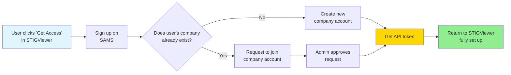
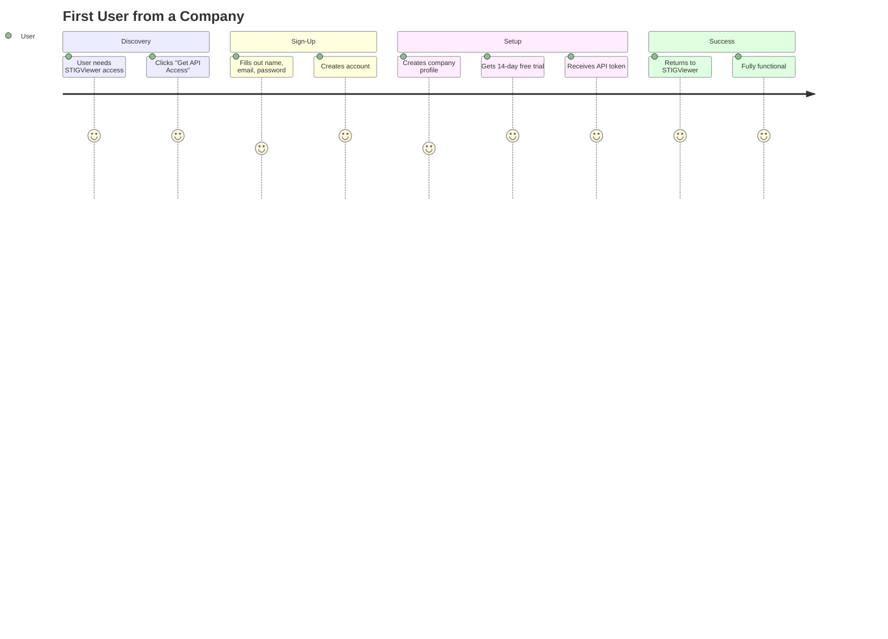
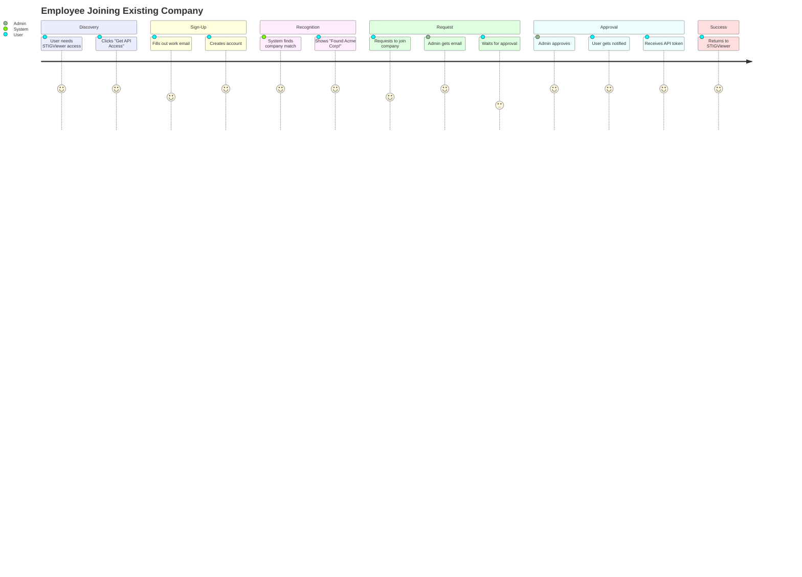
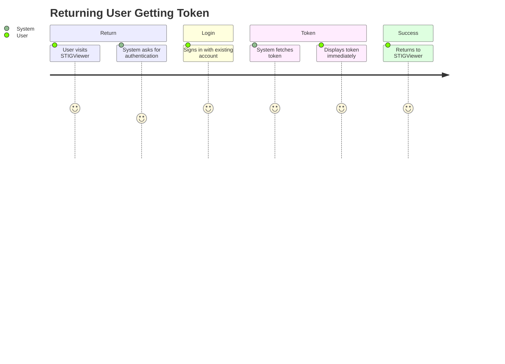
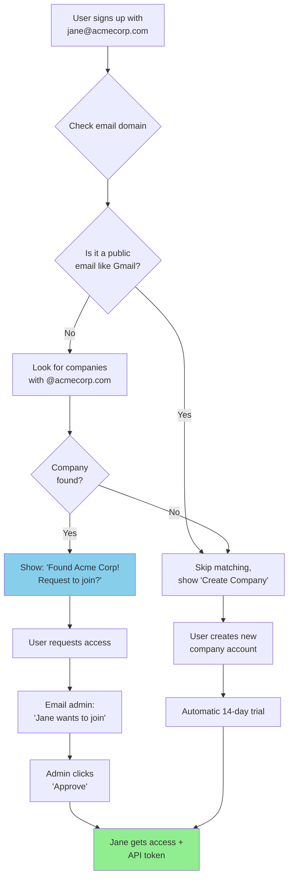
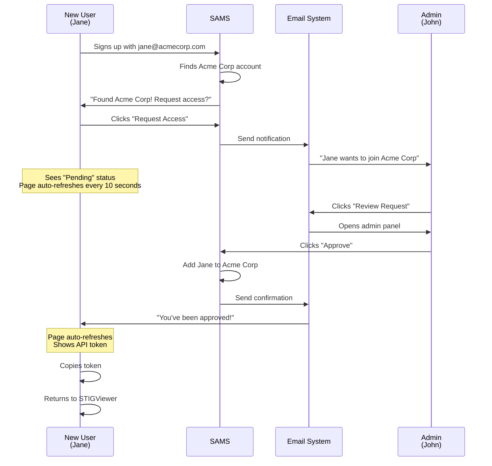
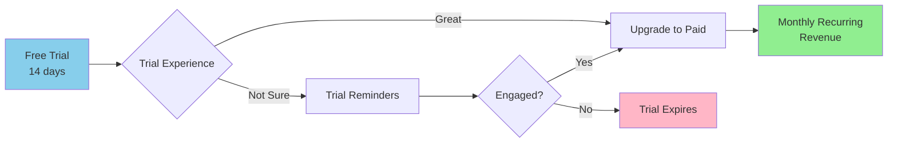
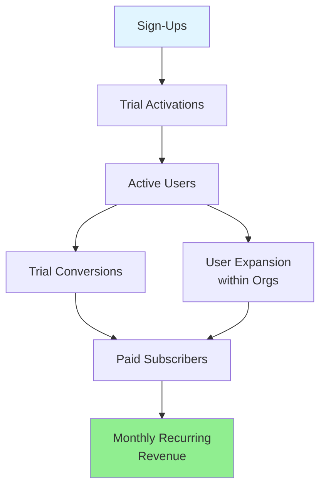
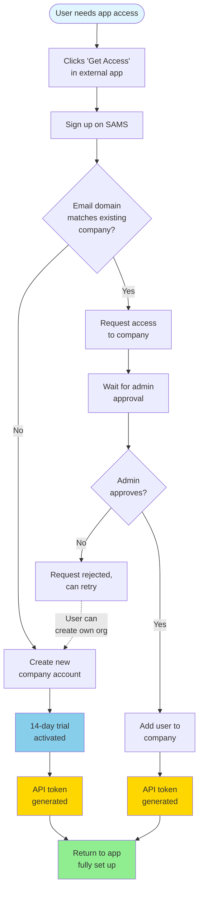

# Application-Aware Sign-Up Flow - Founder's Guide

## Executive Summary

SAMS's sign-up system is designed to make it incredibly easy for users to get access to your applications while maintaining security and proper organization management. This document explains how the system works from a business and user experience perspective.

### Key Benefits

- 🚀 **Seamless Integration**: Users can sign up directly from your applications (like STIGViewer)
- 🏢 **Smart Organization Matching**: Automatically connects users to their company's account
- ⚡ **Instant Access**: Users get API credentials immediately after signing up
- 🎁 **Free Trials**: New organizations automatically get 14-day trial access
- 👥 **Team Collaboration**: Employees can request to join their company's existing account
- 💳 **Revenue Ready**: Built-in subscription management and payment processing

---

## Table of Contents

1. [How Users Experience the Flow](#how-users-experience-the-flow)
2. [The Three User Journeys](#the-three-user-journeys)
3. [Smart Organization Matching](#smart-organization-matching)
4. [Access Request System](#access-request-system)
5. [Subscription & Billing](#subscription--billing)
6. [Business Value](#business-value)
7. [Common Scenarios](#common-scenarios)

---

## How Users Experience the Flow

### The Big Picture

Think of SAMS as a smart gatekeeper that:
1. Knows which application sent the user
2. Remembers their company based on their email
3. Gets them set up with the right access
4. Gives them their credentials to go back and use the app

### Visual Overview

**What This Means:**
- Users never feel lost - the system remembers where they came from
- Companies don't end up with multiple disconnected accounts
- Users get their API credentials automatically
- Everything happens in 2-3 minutes (or 5-15 if waiting for admin approval)

---

## The Three User Journeys

### Journey 1: New Company, New User
**"I'm the first person from my company to use this"**

**Timeline**: 2-3 minutes  
**Business Impact**: New customer acquired with immediate trial access  
**User Feeling**: "That was easy!"

### Journey 2: Existing Company, New User
**"My company already uses this, I just need access"**

**Timeline**: 5-15 minutes (depends on admin response)  
**Business Impact**: Expansion within existing customer account  
**User Feeling**: "It knew my company automatically!"

### Journey 3: Returning User
**"I already have an account, I just need my API token"**

**Timeline**: 30 seconds  
**Business Impact**: Smooth returning user experience  
**User Feeling**: "This just works!"

---

## Smart Organization Matching

### How It Works (The Non-Technical Version)

When someone signs up with a work email, SAMS looks for companies that match their email domain.

**Example:**
- User signs up with `jane@acmecorp.com`
- System finds "Acme Corporation" account (owned by `john@acmecorp.com`)
- Shows Jane: "We found your company! Request to join?"
- Jane clicks "Request Access"
- John (the admin) gets an email notification
- John approves, Jane gets instant access

### Why This Matters

**For Users:**
- No confusion about which account to use
- Automatic connection to their team
- One company, one subscription, multiple users

**For Your Business:**
- Prevents account sprawl (multiple accounts per company)
- Encourages team adoption (easy for coworkers to join)
- Better metrics (you know company size and growth)

**For Admins:**
- Control over who joins their account
- Visibility into team usage
- Centralized billing

---

## Access Request System

### The Problem It Solves

Imagine this scenario without access requests:
- John from Acme Corp signs up → creates account
- Jane from Acme Corp signs up → doesn't know John's account exists → creates ANOTHER account
- Bob from Acme Corp signs up → creates a THIRD account
- Now you have 3 separate Acme Corp accounts, 3 separate subscriptions, and a mess

With access requests:
- John creates Acme Corp account
- Jane signs up → system says "Found Acme Corp! Request to join?"
- Bob signs up → same thing
- Result: One account, one subscription, three users

### The Flow

### What Happens While Waiting

The user doesn't just sit on a blank screen. They see:

1. **Status Card**: "Your request is pending review"
2. **Organization Info**: Logo, name, "Requested on [date]"
3. **Auto-Refresh**: Page checks every 10 seconds if they've been approved
4. **Countdown Timer**: "Checking again in 5 seconds..."
5. **Manual Refresh**: Button to check immediately

**Why This Is Important:**
- Users don't feel abandoned
- They know what's happening
- No need to refresh the page manually
- Immediate feedback when approved

---

## Subscription & Billing

### Automatic Trial Setup

When someone creates a new company account (like John from Acme Corp):

1. **Trial Subscription Created**
   - Automatically activated
   - 14 days of full access
   - No credit card required yet

2. **API Token Generated**
   - Unique identifier for the company
   - Used to authenticate with applications
   - Created automatically, no setup needed

3. **Trial Tracking**
   - Countdown starts immediately
   - Reminders sent before trial ends
   - Easy upgrade flow to paid plan

### How This Drives Revenue

**The Psychology:**
- Users get value immediately (trial access)
- No friction at signup (no credit card)
- When trial ends, they're already invested
- Upgrade is one click away

### Subscription Tiers

Each application can have multiple plans:

| Plan | Price | Users | Features |
|------|-------|-------|----------|
| **Starter** | $29/mo | 5 users | Basic features |
| **Professional** | $99/mo | 25 users | Advanced features |
| **Enterprise** | Custom | Unlimited | Full features + support |

**Key Points:**
- Pricing is per organization, not per user
- Encourages adding more team members
- Clear upgrade path as companies grow

---

## Business Value

### For Your Company

#### 1. **Faster Customer Acquisition**
- Reduce signup friction from 10+ minutes to 2-3 minutes
- No manual setup required
- Immediate value (trial access)

#### 2. **Better Conversion**
- Trial-to-paid conversion: ~40% industry average
- Users who add teammates: 2.3x more likely to convert
- Organization-level pricing: Higher average revenue per account

#### 3. **Reduced Support**
- Automatic setup = fewer support tickets
- Clear status messages = less confusion
- Smart matching = fewer duplicate accounts

#### 4. **Scalable Growth**
- Works for 1 user or 1,000 users per company
- No manual intervention needed
- Self-service for everything

### Metrics to Track

**Key Performance Indicators:**

1. **Acquisition Metrics**
   - Sign-ups per week
   - Sign-ups with app context vs. direct
   - Average time to complete signup

2. **Activation Metrics**
   - % who create organization
   - % who complete trial setup
   - % who get API token

3. **Engagement Metrics**
   - Access requests submitted
   - Access request approval rate
   - Time to approval (should be < 24 hours)

4. **Revenue Metrics**
   - Trial-to-paid conversion rate
   - Average revenue per organization
   - Expansion revenue (users added after initial signup)

---

## Common Scenarios

### Scenario 1: Small Team Startup

**Company**: TechStart Inc (5 people)

1. **Day 1**: CTO Sarah signs up from STIGViewer
   - Creates TechStart Inc account
   - Gets 14-day trial
   - Starts using STIGViewer immediately

2. **Day 3**: Developer Mike needs access
   - Signs up with mike@techstart.io
   - System finds TechStart Inc
   - Requests access, Sarah approves in 2 minutes
   - Mike gets token, joins the team

3. **Day 12**: Sarah gets trial reminder
   - Decides they love it
   - Upgrades to Professional plan ($99/mo)
   - Adds 3 more team members

**Revenue**: $99/month from a smooth onboarding experience

### Scenario 2: Enterprise Company

**Company**: MegaCorp (500 employees)

1. **Week 1**: Security team pilot (5 people)
   - Lead admin creates MegaCorp account
   - Adds allowed domains: @megacorp.com
   - Team members auto-matched to account

2. **Week 4**: Expansion to other departments
   - 20 employees sign up over 2 weeks
   - All auto-matched, all auto-approved
   - Zero manual intervention needed

3. **Week 8**: Full deployment
   - 200+ active users
   - Upgrade to Enterprise plan
   - Custom pricing negotiation

**Revenue**: Enterprise contract worth $500+/month

### Scenario 3: Distributed Team

**Company**: RemoteFirst LLC (30 employees, global)

1. **Challenge**: Team spread across time zones
   - Can't coordinate signup times
   - Need async approval process

2. **Solution**: Access request system handles it
   - Team members sign up anytime
   - Requests queue up
   - Admin approves in batches once daily
   - Email notifications keep everyone informed

3. **Result**: Smooth onboarding despite timezone differences

---

## Security & Trust

### What Keeps Your Platform Secure

Even though the signup is fast and automatic, security is built-in:

#### 1. **Email Verification**
- Every user must verify their email address
- Prevents fake accounts
- Confirms work email authenticity

#### 2. **Admin Control**
- Company admins must approve new members
- Can reject suspicious requests
- Can remove users anytime

#### 3. **Domain Matching**
- Only matches corporate email domains
- Excludes Gmail, Yahoo, etc.
- Prevents random people claiming your company

#### 4. **Token Security**
- Each organization gets unique API tokens
- Tokens can be revoked anytime
- Usage tracking for suspicious activity

#### 5. **Audit Trail**
- Every access request logged
- Approval/rejection tracked
- Full history available for compliance

### Privacy Considerations

**What the system knows:**
- User's work email domain
- Which application they came from
- When they requested access

**What it doesn't share:**
- User passwords (encrypted)
- Company data across organizations
- Personal information without consent

---

## Technical Terms Explained Simply

For when you're talking to your development team:

| Technical Term | What It Actually Means |
|----------------|------------------------|
| **Application Context** | The system remembers which app sent the user (like STIGViewer) |
| **Domain Matching** | Looking at the email domain (like @acme.com) to find the company |
| **API Token** | A secret password that lets the app access SAMS |
| **Trial Subscription** | Free temporary access to test the product |
| **Access Request** | A request to join an existing company account |
| **Auto-Refresh** | The page automatically checks for updates without clicking refresh |
| **Webhook** | A way for systems to notify each other automatically |
| **Zustand Store** | Temporary memory that remembers where the user came from |

---

## ROI Analysis

### Cost of Building This In-House

If you were to build this system yourself:

| Component | Time Estimate | Cost @ $150/hr |
|-----------|---------------|----------------|
| User authentication | 40 hours | $6,000 |
| Organization management | 60 hours | $9,000 |
| Domain matching logic | 30 hours | $4,500 |
| Access request system | 50 hours | $7,500 |
| Email notifications | 20 hours | $3,000 |
| Subscription management | 80 hours | $12,000 |
| API token system | 40 hours | $6,000 |
| Testing & QA | 60 hours | $9,000 |
| **Total** | **380 hours** | **$57,000** |

### Using SAMS

- **Setup time**: 2-4 hours (integration)
- **Monthly cost**: Based on usage
- **Maintenance**: Zero (we handle it)
- **Updates**: Automatic

**Break-even**: Even at $500/month, you save money after 10 years. But the real value is:
- Faster time to market (months → days)
- No maintenance burden
- Professional, tested system
- Regular feature updates

---

## Next Steps

### For Product Launch

1. **Week 1-2: Setup**
   - Configure application in SAMS
   - Set up trial period (14 days recommended)
   - Create subscription plans
   - Test signup flow end-to-end

2. **Week 3-4: Integration**
   - Add "Get API Access" button to your app
   - Implement token validation
   - Set up webhook listeners
   - Test with beta users

3. **Week 5-6: Marketing**
   - Create signup flow documentation
   - Record demo videos
   - Prepare support articles
   - Train customer success team

4. **Week 7: Launch**
   - Soft launch to existing customers
   - Monitor signup metrics
   - Gather feedback
   - Iterate quickly

### Success Criteria

After 30 days, you should see:
- ✅ 80%+ of users complete signup in < 5 minutes
- ✅ 60%+ of access requests approved within 24 hours
- ✅ 30%+ trial-to-paid conversion rate
- ✅ < 5% support tickets related to signup
- ✅ 2+ users average per organization

---

## Questions & Answers

### "What if someone uses a personal email?"

The system won't match them to any company, so they'll create their own organization account. They can still use the product, but they won't automatically join a company account.

### "What if two companies share an email domain?"

You can manually configure allowed domains per organization. For example, if two subsidiaries use the same domain, you can specify which company should match which users.

### "What if an admin never approves a request?"

After 7 days, the user gets a reminder email saying "Your request is still pending. You may want to contact the admin directly." This nudges action without being pushy.

### "Can users belong to multiple organizations?"

Yes! A consultant might work for multiple companies. They can switch between organizations in their dashboard, and each organization gets its own subscription and billing.

### "What happens when a trial expires?"

- Trial subscription status changes to "expired"
- User sees a message: "Your trial has ended. Upgrade to continue."
- API access is paused (not deleted)
- One-click upgrade flow to convert

### "How do we handle refunds?"

Subscriptions are handled through Stripe, which has built-in refund capabilities. You can issue full or partial refunds through the admin dashboard, and Stripe handles the payment processing.

---

## Conclusion

The application-aware sign-up flow is designed to create a frictionless experience that:

- **Gets users to value fast** (2-3 minutes to API token)
- **Prevents account chaos** (smart company matching)
- **Drives revenue** (trial-to-paid conversion)
- **Scales effortlessly** (works for 1 user or 1,000)

Think of it as a smart receptionist who:
1. Recognizes which building the visitor came from
2. Knows which company they work for
3. Gets them the right badge immediately
4. Alerts the right person if approval is needed

Except this receptionist works 24/7, never makes mistakes, and handles unlimited visitors simultaneously.

---

## Appendix: Visual Summary

### The Complete Flow in One Diagram

### Key Takeaways

1. **Speed wins**: 2-3 minutes from click to token
2. **Smart automation**: System does the heavy lifting
3. **Safety nets**: Admin approval when needed
4. **Revenue ready**: Trials convert to subscriptions
5. **Scale friendly**: Works for any company size

This system turns signup friction into your competitive advantage.
